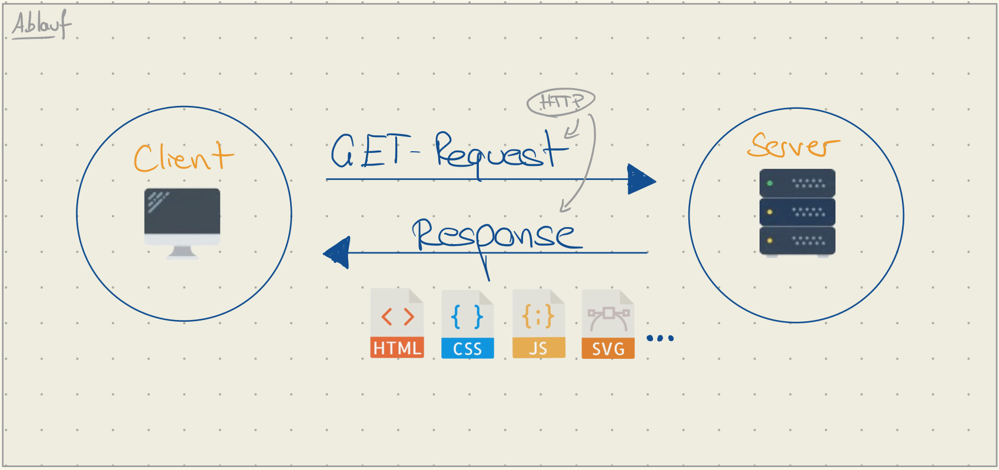

# How the Web Works 

Bevor wir mit der Entwicklung von Webseiten starten, schauen wir uns zunächst einige grundlegende Begriffe und Konzepte an.

## Client-Server Modell 

- :material-laptop: Webbrowser

    ---

    - :material-firefox: Firefox
    - :material-google-chrome: Chrome
    - :material-apple-safari: Safari
    - ...

- :material-server: Webserver

    ---

    - :simple-apache: Apache
    - :simple-nginx: NGINX
    - :simple-caddy: Caddy
    - ...

## URL (Unified Resource Locator)

A __URL__ is the <mark>full web address</mark> used to find a specific resource, like a <mark style="background-color:#ffcbcb">web page or file</mark>, on the internet.

!!! Example
    [https://www.nuernberg.de/internet/rudolf_diesel_fachschule/](https://www.nuernberg.de/internet/rudolf_diesel_fachschule/)
    { .annotate }

    :man_raising_hand: Die URL besteht aus 3 Teilen:

    - Protokoll: `https`
    - Domain: `nuernberg.de`
    - Pfad: `internet/rudolf_diesel_fachschule`

## DNS (Domain Name System)

Wenn du eine URL in den Browser eingibst, wird der Domainname (z.B. nuernberg.de) über das Domain Name System in eine IP-Adresse übersetzt(1). Dank DNS weiß dein Computer also, welchen Server er ansprechen muss, um die Inhalte der gewünschten Website zu laden.
{ .annotate }

1. :blue_book: Vereinfacht funktioniert das DNS wie ein Telefonbuch.

## HTTP (HyperText Transfer Protocol)

- [Spezifikation](https://datatracker.ietf.org/doc/html/rfc9113) für die Kommunikation zwischen Client (1) und Server (2). 
- Stateless[^2]: Jeder Request ist unabhängig vom vorherigen.
- Jeder Response enthält einen Status Code: z.B. <mark style="background-color:#97CE50">200 OK</mark> <mark style="background-color:#FF401F">404 Not found</mark>
- Es gibt verschiedene Typen von Requests (GET, POST, PUT, DELETE)
- `S` in `HTTPS`steht für Secure. Also verschlüsselt.

[^2]: Auf Deutsch: Zustandslos 

